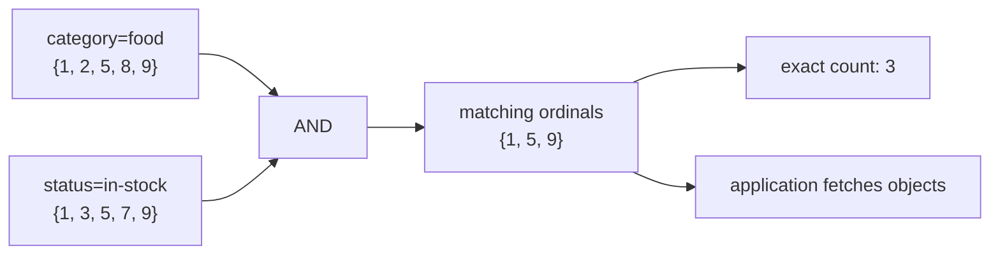
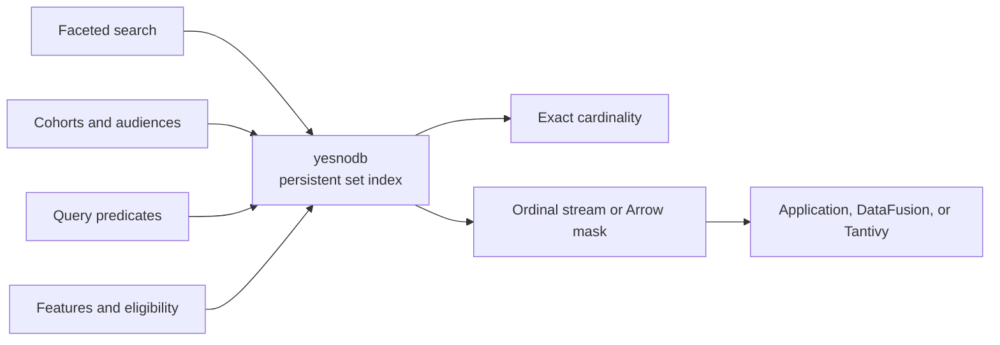

# yesnodb

[](https://github.com/moriyoshi/yesnodb/actions/workflows/ci.yml)

A persistent database for mapping 64-bit keys to sets of 64-bit ordinals.

[yesnodb](https://github.com/moriyoshi/yesnodb) is a persistent inverted index
written in Rust. A key can represent a term, tag, feature, or any other
dimension; its ordinal set is the corresponding posting list. Queries combine
sets with `AND`, `OR`, `XOR`, `AND NOT`, and complement, returning either
matching ordinals or their exact cardinality.

> **Pre-release:** yesnodb is working and extensively tested, but it has not yet
> been operated at production scale. See [Project status](#project-status)
> before using it for important data.

The product is named **yesnodb**. The daemon is `yesnod`, the user-facing data
CLI is `yesno`, and administrative backup and checkpoint operations are under
`yesnoctl`.

Start with the [documentation index](docs/index.md) or the
[getting-started guide](docs/getting-started.md). The documentation also includes
guides to [data modeling](docs/data-modeling.md), the
[query language](docs/query-language.md), [operations](docs/operations.md),
[troubleshooting](docs/troubleshooting.md), and
[integrations](docs/integrations.md).

## Project status

Implemented and covered by tests:

- Roaring-style containers, codecs, and eager and lazy set algebra;
- copy-on-write page storage, WAL recovery, MVCC, checkpointing, and sharding;
- Arrow and DataFusion integration;
- Arrow Flight ingest and queries;
- asynchronous leader-to-standby replication, manual promotion, and
  Kubernetes-managed automatic promotion;
- packed boolean-matrix and arbitrary-precision integer operations;
- packed views with interleaved or blocked layout, constituent selection, and
  union/intersection/parity folds;
- application-side adapters and version-locked plugins for OpenSearch and
  Elasticsearch;
- PostgreSQL foreign-data, index, and table access methods;
- a host-independent C ABI and an experimental MySQL 8.4 storage engine.

Known limitations relevant to deployment:

- The system has not been run at production scale or under a long-lived real
  workload.
- There is no consensus-based leader election. A standalone `yesnod` is promoted
  by hand, with `SIGUSR1` or the control-plane endpoint. Under the Kubernetes
  operator promotion is automatic: an unavailable primary starts a delay-gated
  failover that fences before it promotes, waiting for every Pod of the old
  primary to disappear first, and a monotonically increasing leadership term
  fences a superseded leader that survives anyway, which clients enforce by
  refusing a term below the highest they have seen. What is missing is a quorum:
  the operator is a single external arbiter rather than a consensus protocol, so
  its own availability and correctness bound the guarantee.
- Reloading TLS certificates discards the in-memory TLS session-resumption
  cache, so sessions established under the previous configuration fall back to
  a full handshake. Rotation itself needs no restart: `SIGHUP` re-reads the
  server certificate and the client trust roots together, established
  connections are untouched, and a rotation that would not load is refused
  while the running configuration stays in place.
- A Flight ticket is leased for a bounded interval, after which checkpointing
  may discard its version and the client must request a new ticket.
- Reads are consistent snapshots but not linearizable. A write acknowledged by
  the leader is not automatically visible to that client's next read: the
  visible watermark advances over a consecutive prefix, so a commit that
  resolves while an earlier one is still pending returns a version the database
  does not yet show. A client that needs to read its own write must ask for it —
  an ingest reports the version it committed at, and a read can be bound to that
  version, which waits briefly rather than failing. Reads that do not ask see
  whatever the watermark has reached.
- Mutations carry no idempotency key. Every operation is idempotent in
  isolation, so a retry is safe only when nothing conflicting interleaves; a
  retried insert after another client's delete restores the deleted ordinal and
  reports success.
- There is no compare-and-set or conditional write. A read-modify-write
  performed by a client can lose a concurrent update with no error on either
  side.
- Snapshot eviction can occur to enforce the configured space-amplification
  policy.
- PostgreSQL integration has the consistency and recovery limitations above.
- MySQL integration is nontransactional.

These are design constraints, not a claim that the remaining work is small.
Evaluate yesnodb against your durability, availability, and recovery
requirements before adopting it.

## Concept

yesnodb models each searchable property as a set. The application assigns a
stable ordinal to every object and a numeric key to every property, then stores
the object's ordinal under each key that describes it. For example:



Intersecting these sets finds in-stock food products; unions, differences, and
complements express other Boolean filters. yesnodb stores the index and returns
matching ordinals or their exact count. The application remains responsible for
mapping keys and ordinals to domain values and for storing the objects
themselves.

## Use cases

- **Faceted search and filtering.** Combine tags, categories, states, tenants,
  and other attributes to narrow a catalog or document collection.
- **Cohorts and audience segments.** Build reusable membership sets, combine
  them with Boolean expressions, and obtain either an exact size or the member
  ordinals.
- **Query-engine acceleration.** Push selective predicates into yesnodb, then
  feed matching ordinals or Arrow masks into DataFusion, Tantivy, or another
  execution engine.
- **Sparse feature and eligibility indexes.** Track which entities have a
  feature, satisfy a rule, or belong to a group when the identifier space and
  posting lists may be large.



## Why yesnodb?

- **Persistent sparse sets.** Roaring-style array, bitmap, and run containers
  store `u64` ordinals compactly.
- **Lazy set algebra.** Expressions such as `a AND (b OR c)` stream by
  65,536-bit chunks without materializing intermediate sets. Cardinality
  queries do not materialize their result.
- **Zero-copy reads.** Immutable containers can alias the memory-mapped page
  store directly. Bitmap containers are also Arrow boolean buffers.
- **Durable snapshots.** The storage engine combines a redo-only write-ahead
  log, copy-on-write pages, MVCC snapshots, checkpointing, and reclamation.
- **Query-engine integration.** Satellite crates provide Apache Arrow,
  DataFusion, Tantivy, Arrow Flight, WAL replication, a standalone C ABI, and
  OpenSearch, Elasticsearch, PostgreSQL, and MySQL integration.
- **Packed bit algebra.** The same ordinal representation can be read as dense
  boolean matrices, as arbitrary-precision integers, or as several logical sets
  packed into one ordinal space. See
  [Reinterpreting a set](#reinterpreting-a-set).

Container payloads are byte-compatible with the portable Roaring format. The
[`roaring`](https://crates.io/crates/roaring) crate remains a development-only
differential oracle; it is not a runtime dependency.

## Quick start

The full workspace currently requires Rust 1.95 or newer. `yesno-core` supports
Rust 1.89.

```console
git clone https://github.com/moriyoshi/yesnodb.git
cd yesnodb
cargo run -p yesno-core --example readme
```

### Embedded use

```rust
use std::sync::Arc;

use yesno_core::stream::ChunkStreamExt;
use yesno_core::{Db, Result};

fn main() -> Result<()> {
    let db = Db::open("./yesnodb-data")?;

    db.insert_many(42, &[1, 5, 9, 65_540])?;
    db.insert_many(7, &[5, 9, 13])?;
    db.insert_many(9, &[1, 5])?;
    db.checkpoint()?;

    let snapshot = db.snapshot()?;
    let a = Arc::new(snapshot.load(42)?);
    let b = Arc::new(snapshot.load(7)?);
    let c = Arc::new(snapshot.load(9)?);

    let query = a.stream().and(b.stream().or(c.stream()));
    assert_eq!(query.cardinality()?, 3);
    Ok(())
}
```

This is `key 42 AND (key 7 OR key 9)` over posting lists loaded from one
consistent database snapshot. The checked version also demonstrates eager
agreement and bit-matrix operations in
[`yesno-core/examples/readme.rs`](yesno-core/examples/readme.rs).

### Run the server

```console
cargo build --release -p yesno-server
./target/release/yesnod --data-dir ./yesnodb-data
```

Then ingest and query it from another shell:

```console
./target/release/yesno status
printf '42,1\n42,5\n42,9\n7,5\n7,9\n9,1\n9,5\n' |
  ./target/release/yesno put -
./target/release/yesno query 'and(42,or(7,9))'
./target/release/yesno query --count-only 'and(42,or(7,9))'
```

The last command reads the exact cardinality from Flight metadata and fetches
no ordinals. The query grammar also supports `xor`, `and-not`, `not`, `range`,
ordinal-set literals such as `{1,5,9}`, `key`, `empty`, and packed-view
selection, folding, and expansion.
`yesno view-put` accepts `constituent,ordinal` rows for interleaved or blocked
views. The getting-started guide defines the syntax and descriptor ownership
fully.

`yesnod` serves Arrow Flight and performs periodic checkpoints. Its precedence
order is configuration file, `YESNOD_*` environment variables, then command-line
flags. Validate the resolved configuration without opening the database:

```console
./target/release/yesnod \
  --config yesno-server/dist/yesnod.example.toml \
  --check-config
```

Enable the shared control-plane endpoint by setting its address and journal
directory ( or with the matching `--control-listen` and
`--control-journal-dir` flags ):

```toml
[server.control]
listen = "10.0.0.10:50052"
journal_dir = "/var/lib/yesno-control"

[server.control.tls]
cert = "/etc/yesno/tls/server.pem"
key = "/etc/yesno/tls/server.key"
client_ca = "/etc/yesno/tls/replicas-ca.pem"
require_client_auth = true

[[auth.principal]]
name = "standby-b"
role = "replica"
cert_sha256 = "lowercase-sha256-of-standby-certificate-der"

[[auth.rule]]
channel = "hostssl"
principal = "standby-b"
address = "10.0.0.0/8"
capability = "replication"
action = "allow"
```

One gRPC service surface, exposed through configured TCP and Unix listeners,
serves the typed Protobuf event stream, lifecycle commands, WAL shipping, and
shard-image bootstrap. Authorization rows are evaluated top to bottom like
`pg_hba.conf`; the first channel/principal/address/capability match decides,
and no match denies. Channels are `local`, `host`, `hostssl`, and
`hostnossl`. Configure
`[server.control.tls]` before exposing it. The CRC32C-framed event journal is
synchronized before publication, repairs torn tails, and compacts old history
to a Protobuf state checkpoint; it does not use JSON.

The annotated leader and standby configurations are:

- [`yesnod.example.toml`](yesno-server/dist/yesnod.example.toml)
- [`standby.example.toml`](yesno-server/dist/standby.example.toml)

Deployment assets under [`yesno-server/dist/`](yesno-server/dist/) include a
systemd unit, a per-role Dockerfile, development certificate tooling, and a
two-node replication demonstration.

### Container image

[`dist/`](dist/) builds one unified, multi-architecture image covering
`linux/amd64` and `linux/arm64`, suitable for local Docker, ECS, and Kubernetes
without a variant per target. It carries `yesnod`, the `yesno` data CLI,
`yesnoctl`, `yesno-archive`, `yesno-snapshot-stage`, `yesno-snapshot-agent`, and
`yesno-operator`, and
selects between them on the first argument, so the same reference serves a
Kubernetes pod that supplies only `args`, an ECS task whose command override
begins with a binary name, and a plain `docker run`:

```console
./scripts/build-release-image.sh                    # host arch, as yesnodb:local
docker run --rm yesnodb:local --data-dir /var/lib/yesno --insecure
docker run --rm yesnodb:local yesnoctl --help
```

Publishing the manifest list is explicit and separate:

```console
./scripts/build-release-image.sh --tag ghcr.io/moriyoshi/yesnodb:0.1.0 --push
```

In CI this is continuous: `.github/workflows/release.yml` runs the full `ci.yml` gate
first and publishes only if it passes, so a commit that fails clippy or the
oracle suite ships nothing. A merge to `main` publishes `edge` and
`sha-<commit>`; a `v1.2.3` tag publishes `1.2.3`, `1.2`, `1`, and `latest`.
`latest` follows releases and never the tip of development. See
[`docs/operations.md`](docs/operations.md) for which tag to pin.

The build is two stages — cross-compile per architecture, then assemble — so the
architectures can be built concurrently, and neither stage ever emulates:
compilation is pinned to the build platform and the assembly stage is pure
`COPY`. The LVM userspace that `yesno-snapshot-agent` needs is fetched and
unpacked for the target architecture in a native stage, since downloading and
unpacking a `.deb` runs none of its code. No QEMU or `binfmt_misc` registration
is needed on any host.

The image's user is unprivileged. Shipping the snapshot agent does not change
that: it needs uid 0 and `CAP_SYS_ADMIN`, which its deployment grants to that
container alone.

Deployment details for each target — the `Recreate` requirement, local-volume
requirement, security context, and the probes that ECS and Kubernetes need
because neither reads the image's healthcheck — are in
[`docs/operations.md`](docs/operations.md).

Kubernetes users can start with the [`yesno-operator`](yesno-operator/README.md),
which manages leader/follower deployments, retained per-instance storage,
health probes, stable read-write/read-only discovery, fenced automatic
promotion, and resource status.

## Data model

yesnodb stores:

```text
u64 key -> set of ordinals in [0, 2^64 - 2]
```

`u64::MAX` is reserved. Keeping one value outside the ordinal universe makes a
full-set cardinality representable as `u64` and lets the half-open range
`[0, u64::MAX)` name the entire universe.

Each ordinal is split into a 48-bit chunk prefix and a 16-bit position. A chunk
contains 65,536 possible ordinals and its dense representation is exactly
8 KiB. This geometry is part of the format, not a tuning parameter.

For the mathematical model and the invariants behind the format, see
[`docs/formal-model.md`](docs/formal-model.md).

## Reinterpreting a set

An ordinal set is a bit vector, and fixing an affine layout over that bit vector
reads it as something other than a set. yesnodb ships three such lenses, and none
of them adds a storage format: the durable object is still the ordinal set, the
layout is a descriptor the caller constructs, and results are written back
through ordinary set operations.

| Lens | Reads one set as | Described by |
|---|---|---|
| Bit matrices | a series of dense M × N boolean matrices | rows, columns, and independent line and matrix strides |
| Big integers | a series of unsigned arbitrary-precision integers | a width in bits and a stride |
| Packed views | `n` constituent sets sharing one ordinal space | a constituent count and an interleaved or blocked layout |

A layout is never persisted, and the server keeps no catalog of descriptors. One
key read under two descriptors yields two different, well-formed interpretations
rather than an error, so a descriptor is application schema and belongs with the
ordinal assignment itself.

One property is shared by all three and is worth knowing before choosing a
layout: when the layout introduces no padding, the ordinal set and the series it
is read as are the same object. `AND`, `OR`, and `XOR` on sets are then already
the elementwise operations on whatever the lens sees, with no conversion and no
separate code path. Padding buys aligned loads and gives that identity up; both
choices are legitimate and the choice is the caller's.

### Bit matrices

Element `( r, c )` of matrix `k` sits at ordinal
`k*matrix_stride + r*line_stride + c`, in row-major or column-major order. The
chunk geometry lines up with the sizes worth naming: a chunk is 65,536 bits, so
an 8 × 8 matrix is one 64-bit word, 64 × 64 is 64 words, and 256 × 256 is exactly
one container.

The algebra is defined over two semirings — Boolean, where `+` is `OR`, and
GF(2), where `+` is `XOR`. Both carry multiplication, counted multiplication,
transpose, elementwise operations, reductions, predicates, submatrices, and outer
products; GF(2) adds elimination, rank, inverse, `Ax = b`, a reusable `PA = LU`
factorization that pays off across several right-hand sides, and matrix powers.

A matrix read this way is a dense value, bounded by the layout and materialized
in memory — not a growable container and not a sparse matrix store. A caller
reads one matrix, computes on it, and encodes the result back into containers
once at the end rather than once per operation.

### Arbitrary-precision integers

Bit `j` of integer `k` sits at ordinal `k*stride + j` and carries the `2^j` term.
Width belongs to the layout and to nothing else: a stored integer has the
declared width, while an arithmetic value carries none and grows as the
arithmetic requires it to.

Reading is least-significant-bit first, and there is deliberately no other order,
because that is what keeps this lens agreeing with the set algebra. Two integers
with no bit in common satisfy `a + b == a | b`, so their union is their sum;
`XOR` is addition without carry; and reading a stored integer under a narrower
width yields exactly `x mod 2^width`.

The arithmetic is unsigned. Subtraction below zero returns nothing rather than
wrapping, because a value carries no width to wrap to. The ladder is schoolbook
multiplication below a measured 20-limb crossover and Karatsuba above it, Knuth
Algorithm D division, Barrett reduction, and modular exponentiation. Toom-3 and
Burnikel-Ziegler are absent by measurement rather than by omission: their
break-even points sit past roughly 256 and 512 limbs respectively, and an index
does not produce operands that large.

This is not a cryptographic library. Nothing in it is constant-time — the
multiply arms dispatch on limb count, division branches on operand values, and a
value's length is itself data-dependent — so do not run it on secret material.
The [`num-bigint`](https://crates.io/crates/num-bigint) crate is a
development-only differential oracle here, exactly as `roaring` is for
containers.

### Packed views

A view maps `( constituent, logical ordinal )` to a physical ordinal and back, so
`n` logical sets share one physical posting list. The two layouts are transposes
of each other:

```text
interleaved(n):      constituent i, logical x  ->  x * n + i
blocked(n, stride):  constituent i, logical x  ->  i * stride + x
```

which is why the same questions have opposite costs under them:

| Question | `interleaved` | `blocked` with an aligned stride |
|---|---|---|
| Extract one constituent | a strided filter over every stored ordinal | a windowed relabel that shares container payloads |
| Count one constituent | a strided filter over every stored ordinal | at most two containers probed |
| Reach every slot of one logical ordinal | adjacent, one cache line | `n` distant regions |
| Test membership in one constituent | a search | a search |

Measured over four constituents and 200,000 logical ordinals, an aligned blocked
layout extracts a constituent about 18,000x faster than an interleaved one and
counts one about 59,000x faster, while membership costs the same under both.
Those runs were taken on a heavily loaded machine, so the ratios are the result;
the absolute timings have not been re-measured on a quiet one and are not quoted
here.

"Aligned" means a blocked stride that is a multiple of 65,536, which puts every
constituent boundary on a container boundary. That condition is what does the
work, not the layout: a blocked stride that is not a multiple of 65,536 loses the
specialization entirely and extracts roughly 4,000x slower than an aligned one.
Choose the layout from the read pattern, then treat the descriptor as durable
schema.

Beyond selecting one constituent, a view folds all of them into a single logical
set with `any`, `all`, or `parity` — union, intersection, and symmetric
difference — and expands a coarse logical set back into every constituent slot. A
fold is not a filter and pushes through nothing unconditionally: each reduction
is exact for its own operator only, while expansion, being an inverse image,
distributes over every Boolean operator. Two sets packed under the same view
need no view-aware operation at all, since `AND`, `OR`, and `XOR` on them are
already the elementwise operations across all `n` constituents at once.

The [data-modeling guide](docs/data-modeling.md) covers when packing is worth it,
and the [query-language reference](docs/query-language.md) gives the
`view`, `fold`, `pack` and `expand` syntax, along with the vector sort they
operate on.

## Workspace

| Package | Role |
|---|---|
| `yesno-core` | Containers, set and bit algebra, page store, WAL, MVCC, and `Db` |
| `yesno-arrow` | Arrow selection masks, record-batch streams, and bulk building |
| `yesno-datafusion` | Predicate lowering and the `yesno_lookup` table function |
| `yesno-wire` | Set-expression wire format shared by clients and servers |
| `yesno-flight` | Arrow Flight queries and bulk ingest |
| `yesno-flight-c++` | Synchronous client over Apache Arrow's native C++ Flight API |
| `yesno-tantivy` | Generation-bound Tantivy queries over embedded or remote yesno results |
| `yesno-flight-python` | Python package (`yesnodb`): typed Flight client and expression builder |
| Java package (`dev.yesnodb.client`) | Typed Arrow Flight client with RoaringBitmap interoperability |
| `yesno-search-java` | Java resolver and REST query adapters for portable OpenSearch/Elasticsearch bitmap filters |
| `yesno-opensearch-plugin` | OpenSearch 3.8 coordinator rewrite from yesnodb expressions to native bitmap terms |
| `yesno-elasticsearch-plugin` | Elasticsearch 9.5 coordinator rewrite with a portable Roaring doc-values filter |
| Go module (`yesno-flight-go`) | Native Arrow Go Flight client with streaming reads, writes, TLS/auth, and fencing |
| `yesno-server` | The `yesnod` daemon, `yesno` data CLI, and single-leader WAL replication |
| `yesno-server-utils` | The `yesnoctl` admin CLI plus continuous object archive |
| `yesno-e2e` | Python-driven end-to-end scenario runner |
| `yesno-c` | Host-independent C ABI with opaque database and snapshot-cursor handles |
| `yesno-mysql` | Experimental MySQL 8.4 ordinal-set engine with embedded and remote backends |
| `yesno-pg` | PostgreSQL foreign-data, index, and table access methods |

`yesno-core` deliberately excludes async runtimes, gRPC, and Arrow Flight. The
network and query-engine dependency trees remain in satellite crates.

`yesno-pg` is outside the Cargo workspace and is built with Bazel so its shared
library is compiled and tested against pinned PostgreSQL 17 and 18 server ABIs. Run
`./scripts/gate-pg.sh` rather than `cargo pgrx test`.

`yesno-c` is a separate Cargo workspace so it can keep the core Rust 1.89
floor and emit static and shared libraries independently. Bazel also builds its
static library as the embedded Rust input to `yesno-mysql`; the MySQL gate also
builds `yesno-flight-c++` against pinned Arrow C++ and compiles the plugin and
pinned MySQL 8.4.0 together. See the
[`README`](yesno-mysql/README.md) for the exact schema and build procedure.

## Replication

yesnodb supports physical bootstrap followed by asynchronous WAL shipping from
one leader to a standby. A standby can remain cold or serve read-only queries.
Promotion is an operator action, and leadership terms let followers and clients
reject a superseded timeline.

Important operational properties:

- Replicas are always potentially stale; do not use them for read-after-write.
- There is no leader election. Operators must ensure the old leader is stopped
  before promotion.
- A superseded leader cannot discover its own replacement. Clients that need
  fencing must require a leadership term.
- Replication is not a backup and does not provide zero-RPO failover.
- Replication and lifecycle control share the authenticated control-plane
  endpoint; explicit rules keep their capabilities separate.
- `yesnoctl basebackup` takes a hot, independently restorable copy through
  that endpoint.
- `yesno-archive` subscribes lifecycle events and replication WAL on that same
  endpoint, publishing Protobuf state, term-fenced WAL objects, and portable,
  ZFS/Btrfs/LVM, or explicit-network checkpoint bases to local or S3-compatible
  object storage.
- Local LVM snapshots use a separate `yesno-snapshot-agent` process on the same
  Unix control socket, keeping `CAP_SYS_ADMIN`, device access, and mount tools
  out of `yesnod`.
- `yesnoctl restore` verifies an archived base and immutable WAL history, then
  reconstructs an exact committed logical version or the durable archive tip.

The [operations guide](docs/operations.md) gives the backup, restore,
promotion, fencing, and rejoin procedures. The two-node demonstration exercises
bootstrap, a read-serving replica, role separation, and manual promotion:

```console
cargo build --release -p yesno-server -p yesno-server-utils
./yesno-server/dist/two-node.sh
```

## Integration with other databases

### OpenSearch and Elasticsearch integration

yesnodb can supply precomputed ordinal filters to both search engines. The
[`yesno-search-java`](yesno-search-java/README.md) library resolves a yesnodb
expression over Arrow Flight and returns portable bitmap query JSON for an
application's existing OpenSearch or Elasticsearch client.

For engine-side resolution, version-locked plugins add a `yesno` query that
resolves the expression on the coordinating node before shard fan-out. The
[`yesno-opensearch-plugin`](yesno-opensearch-plugin/README.md) targets
OpenSearch 3.8.0 and rewrites results to its native bitmap-valued `terms`
query. The
[`yesno-elasticsearch-plugin`](yesno-elasticsearch-plugin/README.md) targets
Elasticsearch 9.5.2 and matches the portable bitmap against numeric document
values. Both plugins enforce configurable match-count, bitmap-size, and Flight
timeout limits.

### PostgreSQL integration

The experimental `yesno-pg` extension provides three surfaces:

- a foreign data wrapper for remote ordinal sets;
- an index access method for ordinary PostgreSQL heaps;
- a table access method for a single-column `bigint` set.

The extension is not a general replacement for PostgreSQL storage. Its data is
outside PostgreSQL WAL, and cross-engine commits are not atomic: a yesno table
and an ordinary table in one query can disagree, because the two commit at
different moments. Treat it as experimental and back up its yesnodb data
separately.

Isolation *within* a yesno table is honoured. A `REPEATABLE READ` transaction
pins a version on first access and reads every later statement through it;
`READ COMMITTED` pins one version for the duration of each statement, so two
scans in that statement agree, then releases it so the next statement can see a
newer commit. Installation status and examples for all three surfaces are in the
[integrations guide](docs/integrations.md).

### MySQL integration

The experimental `yesno-mysql` storage engine exposes one yesnodb key as one
table containing a single `BIGINT UNSIGNED NOT NULL PRIMARY KEY` column. It
supports inserts, deletes, exact and range reads, ordered scans, exact counts,
truncate, rename, and drop. The `CONNECTION` value `key=<u64>` selects the
underlying ordinal set.

The engine is deliberately nontransactional: successful writes commit to
yesnodb immediately, MySQL rollback cannot undo them, and cross-engine commits
are not atomic. Scans do hold stable yesnodb snapshots. At startup the plugin
selects either the embedded [`yesno-c`](yesno-c/README.md) backend or a remote
backend implemented by [`yesno-flight-c++`](yesno-flight-c++/README.md).
`scripts/gate-mysql.sh` builds both clients, pinned Arrow C++, pinned MySQL
8.4.0, and `ha_yesno.so` with Bazel, then runs the checked fixture in a
throwaway server.

## Frequently asked questions

### Does yesnodb store my application objects?

No. It stores numeric keys and their sets of numeric ordinals. Your application
owns the mapping from domain values to those numbers and stores the objects
themselves.

### Why is each shard image 1 GiB immediately after creation?

Each `shard-NNNN.yno` is mapped in fixed 1 GiB segments. A new shard therefore
has a logical file length of 1 GiB, but the file is sparse: unwritten regions
are holes and normally consume neither disk blocks nor resident memory.
`ls -lh` reports the logical length; `du -h` reports allocated disk space on
filesystems that preserve sparse holes. If both report about 1 GiB immediately,
check whether the filesystem, volume, or copy process materialized those holes.

The image grows by another logical 1 GiB segment when needed and never shrinks
while in use. The separate `wal_bytes = "1GiB"` setting is a checkpoint trigger;
it does not preallocate a 1 GiB WAL file.

### Does yesnodb store 32-bit or 64-bit ordinals?

Ordinals are unsigned 64-bit values in `[0, 2^64 - 2]`. `u64::MAX` is reserved
so the cardinality of the complete ordinal universe remains representable.

### Is a replica also a backup?

No. Replication can copy corruption or operator mistakes and is always
potentially behind the leader. Use the backup and archive procedures in the
[operations guide](docs/operations.md) for independently restorable copies.

### Can yesnodb use NFS or another network filesystem?

No. The page store requires coherent local `pwrite` and `MAP_SHARED` behavior.
It supports local filesystems on 64-bit Linux and macOS, not Windows or network
filesystems such as NFS.

## Performance and testing

Benchmarks compare set-operation kernels with the `roaring` crate and keep the
packed-lens comparisons beside the implementation they measure:

```console
cargo bench -p yesno-core --bench setops
cargo bench -p yesno-core --bench bitmatrix
cargo bench -p yesno-core --bench bignum
cargo bench -p yesno-core --bench view
```

The test suite combines boundary-biased property tests, semantic and byte-level
Roaring differential tests, eager/lazy expression equivalence, allocation
budgets, crash and recovery matrices, zero-copy lifetime tests, and end-to-end
Python scenarios against a real database.

Run the routine checks with:

```console
cargo fmt --check
cargo clippy --workspace --all-targets --all-features -- -D warnings
cargo test -p yesno-core
```

Run the broader gates with:

```console
cargo test --workspace
./scripts/gate.sh
./scripts/gate-pg.sh
./scripts/gate-mysql.sh
./scripts/gate-search.sh
./scripts/gate-operator.sh
./scripts/gate-filesystems.sh
./scripts/gate-mount-propagation.sh
AWS_REGION=ap-northeast-1 ./scripts/gate-aws.sh
```

Docker is the only host dependency of every gate above except the AWS one. Five
of them run in a single all-in-one `yesno-e2e:local` image, which carries the
pinned build toolchains and artifact caches for PostgreSQL, MySQL, OpenSearch,
and Elasticsearch, the Kubernetes tools the operator gate drives, and the QEMU
guest the filesystem gate boots. Building it for any one of those therefore
prepares all five, and a later gate on an unchanged checkout reuses the retained
layers. Set `YESNO_E2E_IMAGE` to choose a different tag.

The mount-propagation gate is the exception: it uses stock containers rather
than that image, because what it tests is the container runtime's own mount
propagation, and running it inside the shared image would put the thing under
test and the harness in the same namespace.

The first build in a fresh checkout is long and the result is tens of
gigabytes, because it compiles two PostgreSQL majors, MySQL, and Arrow C++ from
pinned source. That is the deliberate trade for a host contract of "install
Docker".

The operator gate needs Docker; the filesystem gate needs Docker and
`/dev/kvm`. The image boots a disposable guest with real ZFS, Btrfs, and LVM
rather than requiring those storage stacks on the host, and runs the shipped
`yesnod`, `yesno-archive`, and `yesnoctl restore` workflow against a pinned,
stateful Winterbaume S3 server it carries.

The AWS gate is separately opt-in and billable. Terraform creates a private
test VPC, an ingress-free SSM-managed EC2 runner, an encrypted source EBS
volume, a run-scoped IAM role, and a temporary ECR repository. It builds and
pushes the exact checkout, executes the EBS snapshot scenario through SSM, and
destroys the stack on success or failure. It is the one gate with its own image:
a slim runner, because that image is pushed to a per-run ECR repository and
pulled onto an EC2 host, where the all-in-one artifact tree would be paid for in
transfer on every billable run. The caller needs Terraform, AWS CLI,
Docker Buildx, AWS credentials able to create that infrastructure and invoke
SSM, and an explicit `AWS_REGION`. Set `YESNO_AWS_KEEP=1` only when intentionally
retaining billable failure state for diagnosis.

## Platform

yesnodb targets 64-bit Linux and macOS on local filesystems. The page store
depends on coherent `pwrite` and `MAP_SHARED` behavior and is not supported on
Windows or network filesystems such as NFS.

## Project policies

- [Changelog](CHANGELOG.md)
- [Contributing](CONTRIBUTING.md)
- [Security policy](SECURITY.md)

## License

Licensed under either the
[Apache License, Version 2.0](LICENSE-APACHE) or the [MIT License](LICENSE-MIT),
at your option. See [NOTICE](NOTICE) for the attribution notice that applies to
the Apache-2.0 option.

Unless explicitly stated otherwise, contributions intentionally submitted for
inclusion in yesnodb are dual-licensed on the same terms.
